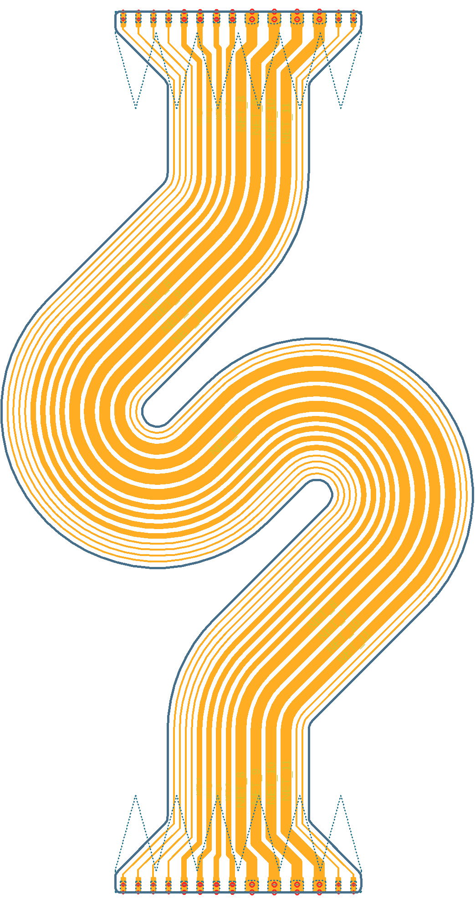
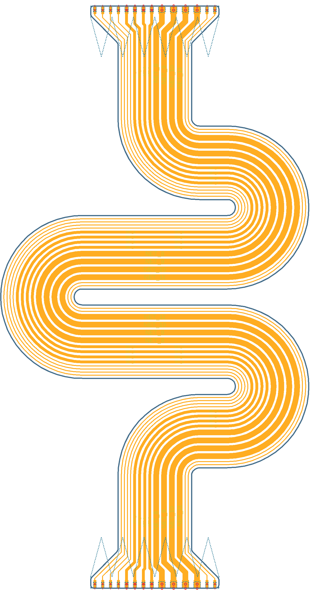
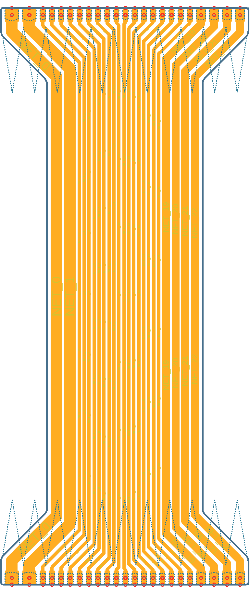
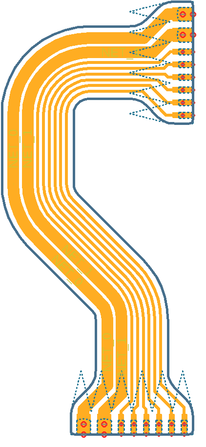
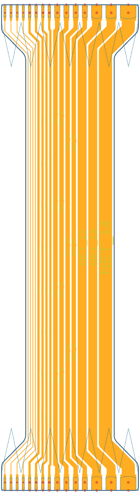

# FFSC (Flat Flexible Soldered Connector) Generator

This is a Python script designed to generate FFSC designs - soldered, flexible PCB interconnects as seen [here] - [and here].

* Fully configurable
* Supports bendy connections with multiple segments

## Use

* Install any version of Eagle later than 6.5.0.
* Edit `parameters_x.py` to your liking
* Run `ffsc-generator.py` - A Eagle script will be generated
* Create a new board in Eagle, choose the option 'Execute Script' and select the script
* Optionally load the design rule file `drc-disable.dru`

   [here]: <https://oliver.st/blog/flexible-pcb-connections/>
   [and here]: <https://oliver.st/blog/generating-ffsc-designs/>

## Examples

### `parameters_1`
---

### `parameters_2`
---

### `parameters_3`
---

### `parameters_4`
---

### `parameters_5`
---

